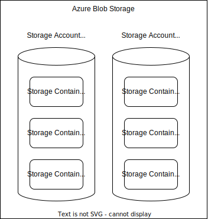
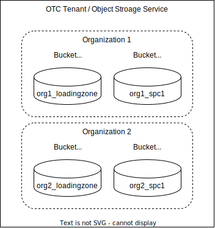

# 0001 Support S3 Storage

Date: 2022-10-04

## Status

**<u>Proposed</u>** | Accepted | Reverted

## Context

We want the SDK to be able to run on other cloud providers than just Microsoft Azure, as many customers or users need or want to choose their own cloud provider of trust (i.e. to be more compliant to the GAIA-X project or to fulfil certain data privacy requirements).
Relating to the storage, we want customers to be able to choose an S3 storage for the SDK instance, as many cloud providers like Open Telekom Cloud (OTC) provide the S3 API.
We want the StorageManager service to abstract away the cloud provider specific implementations to be able to add other storage solutions in future.
At the deployment of the StorageManager we want to be flexible to select a preferred environment to deploy on (like Azure or OTC).
We need a mapping schema for organizations and spaces to S3 buckets and objects.

## Considerations

### Mapping Organizations and Spaces to S3 Buckets and Objects

Within the current implementation for Azure Blob Storage we have a mapping of organizations to Azure Storage Accounts and spaces to Azure Storage Containers. The advantage is that organizations are strictly seperated, seperate access keys can be defined.

There is no subgrouping layer like Storage Containers to define seperate spaces inside an organization on S3 providers. S3 storages are simply organized in buckets that hold objects (or object keys containing values). There are multiple possible options to map organizations and spaces to S3 buckets and objects.

#### Multiple Tenants

Every organization is an own cloud provider tenant.

The big problem with this approach is scalability as most cloud providers (like OTC) define (soft) limits for a maximum of about 100 buckets (in case of AWS and OTC) per tenant. That means a maximum of 100 spaces for each organization.

Another problem is maintainability. A new organization means creating a new tenant with users, access rights, keys, domain, object storage service etc. and this has to be creatied dynamically when an SDK user is creating a new organization.

#### Bucket per Space

Spaces are buckets and organizations are a logical group of buckets using naming conventions (prefix) for bucket names.

A strict seperation is possible while using the cloud providers IAM and security policy possibilities (i.e. policies for user roles to only allow access to buckets of a given organization). But this would be a solution with cloud provider specific security implementation.

Also this approach does not scale very well. With the limit of 100 buckets per tenant there would be a maximum of 100 spaces globally (i.e. having 5 organizations means a maximum of about 20 spaces for each organization).

#### Bucket per Organization

An organization is a bucket and the spaces are defined using naming conventions (prefix) for object keys.

In terms of scalability this means a maximum of 100 organizations per tenant but unlimited spaces inside an organization.

There is still strict seperation of organizations and operations like moving data for a whole organization are more secure avoiding access errors with bad consequences.

#### Global Bucket

There is one global bucket for the SDK storage. Organizations and spaces are logical groupings using naming conventions (prefix) for object keys.

With this approach there is no scalability problem anymore (meaning unlimited organizations and spaces).

Furthermore there is no provider specific security implementation needed but S3 features like object ACLs could still be used. Security can be fully managed by the SDK. On the other hand that means less strict seperation of organizations and spaces so it's up to the SDK to avoid access errors with bad consequences.

Features like storage classes (hot, warm, cold) are supported on object level with most cloud providers and can still be used.

A virtual folder structure can be created inside the bucket using '/' in object key prefix as seperator.

This approach is most flexible and supports the current implementation using a system principal. A pure S3 implementation is possible (using any S3 client API) meaning optimal S3 storage provider (cloud provider) abstraction for the SDK using.

### Client Interface Abstraction

The current implementation of the StorageClient interface is specific to Azure:

An abstraction of the underlying storage system could be defined like the following:

## Decision

We will use the global bucket mapping option (one global S3 bucket as storage for the SDK). Organizations and spaces are logical groupings using naming conventions (prefix) for object keys. This approach is most flexible, supports the current implementation using a system principal and means better S3 storage provider (cloud provider) abstraction.

We will use a (virtual) folder hierarchy with the naming conventions for object keys ("orga1/space1/" as prefix for a space "space1" in organization "orga1"). Empty objects with the prefix itself as object key can be used to create objects rendered as virtual folders in most GUI S3 clients.

We will redefine the storage client interface to abstract away cloud provider specific implementation. We will add a level of abstraction by generalizing the StorageClient interface to be generic or SDK specific. Cloud provider specific functionality goes to the implementing classes.

We will use profiles to make deployment of the service easy for different storage providers (i.e. "local" for local testing storage on the file system, "azure" for using an Azure Blob Storage, "s3" for using an S3 storage).

## Consequences

The other storage related services like AccessManager also need to be extended to support S3 storage (i.e. using presigned URLs instead of SAS token needed). New endpoints will be needed and consumers of those (like the frontend) need to be able to use those (i.e. uploading files using the frontend with presigned URLs instead of SAS token).

Current deployment environment (pipelines) needs to be adopted to run the proper profile (i.e. set Spring profile "azure" for the current Azure Pipelines).
